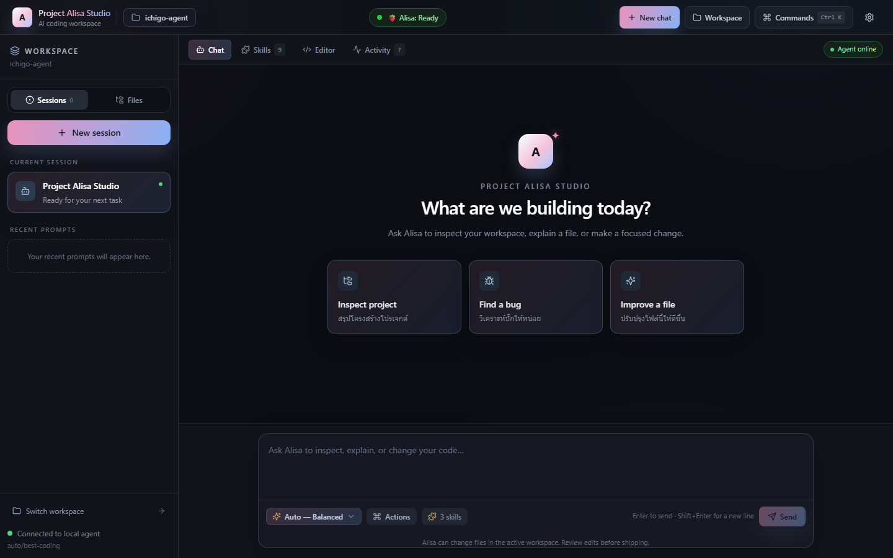
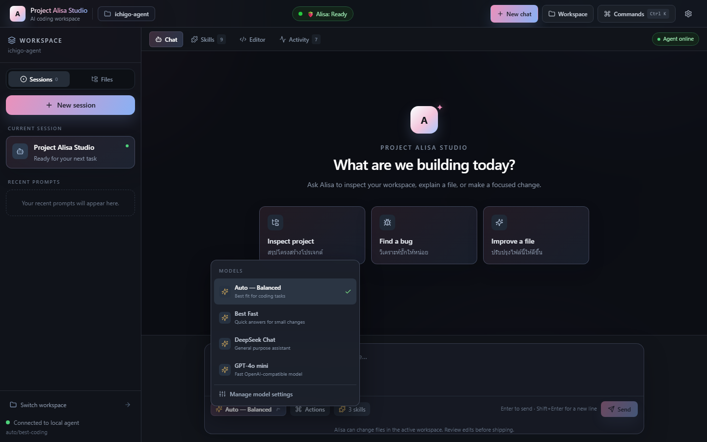
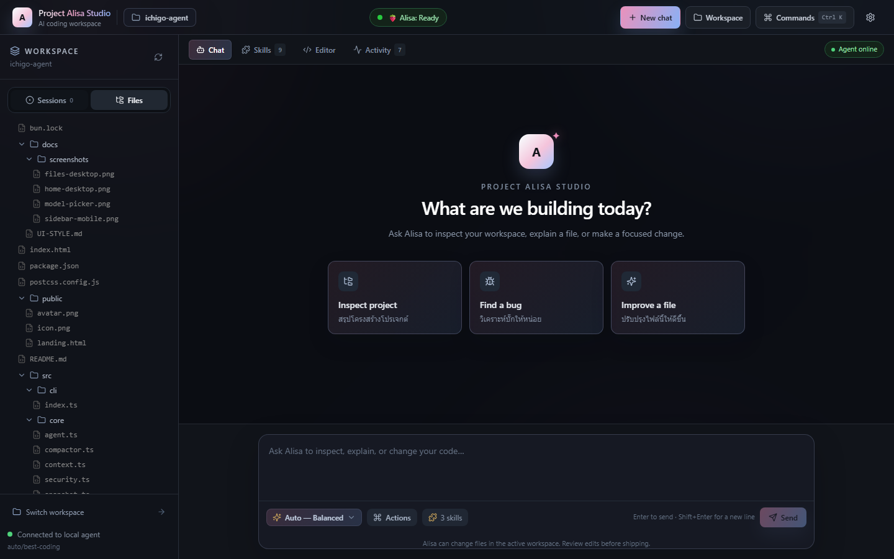
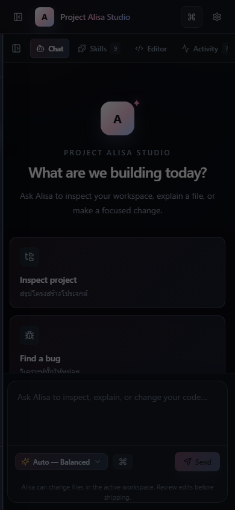

# Project Alisa Studio UI style

Project Alisa Studio keeps the compact, keyboard friendly layout of OpenCode and uses the visual language from Yurachi Studio: a quiet dark canvas, soft pink and blue light, rounded glass surfaces, and small details that make the workspace feel personal without getting in the way of code.

## Screenshots

## Visual tokens

| Token | Value | Use |
| --- | --- | --- |
| Canvas | `#0b0d12` → `#11131b` | Main workspace background |
| Yurachi pink | `#ef8fbd` | Primary actions and warm emphasis |
| Yurachi blue | `#86b3ff` | Cool emphasis and focus states |
| Yurachi violet | `#bba7ff` | Secondary identity accent |
| Surface | `rgba(24, 28, 38, .76)` | Composer, workspace badge, dialogs |
| Hairline | `rgba(174, 188, 226, .16)` | Separation without heavy borders |

The UI uses the existing system sans stack for predictable rendering and a monospace stack for code and terminal output. Rounded corners stay between 8px and 16px for controls, with larger 20px surfaces for the composer and session cards.

## Interaction rules

- **Sessions first:** the sidebar opens on Sessions, with New session, the current workspace session, and recent prompts. Files remains one click away.
- **Composer first:** model selection, Actions, active skills, and Send/Stop live in one toolbar. Enter sends; Shift+Enter inserts a line break.
- **Workspace is visible:** the active folder and agent connection stay visible in the header/sidebar so file actions have clear context.
- **Mobile is a drawer:** the sidebar starts closed below 768px, opens over the chat with a scrim, and closes after selecting a file or session.
- **Updates are explicit:** installed builds check GitHub Releases. An available update shows Download, a completed download shows Restart to update, and errors provide Try again.

## Reference

The palette and surface treatment are adapted from the Yurachi Studio reference page in `C:\Users\DELLPC\Desktop\yurachi-studio-website\index.html`. The dark adaptation preserves contrast for long coding sessions while retaining the pink/blue gradient identity.
